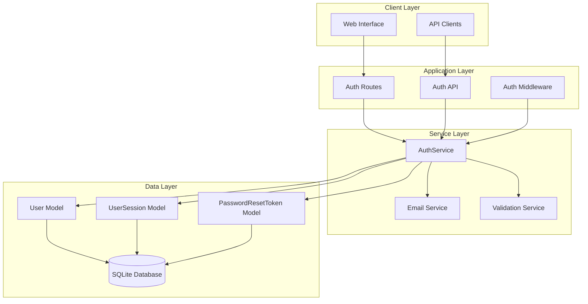

# Design Document: User Authentication System

## Overview

The Active Recall app will enhance its existing authentication foundation with a comprehensive user authentication system that provides secure registration, login, session management, and profile functionality. The design builds upon the current Flask-SQLAlchemy architecture while implementing modern security practices and seamless user experience.

The system leverages the existing User, UserSession, and PasswordResetToken models while enhancing the web interface, API endpoints, and security measures to meet production-grade requirements.

## Architecture

### High-Level Architecture



### Security Architecture

The authentication system implements multiple layers of security:

1. **Password Security**: Werkzeug password hashing with salt
2. **Session Management**: JWT-like session tokens with expiration
3. **Rate Limiting**: Protection against brute force attacks
4. **Input Validation**: Server-side validation for all user inputs
5. **CSRF Protection**: Flask's built-in CSRF protection
6. **Secure Headers**: Security headers for web responses

## Components and Interfaces

### AuthService (Enhanced)

The existing AuthService will be enhanced with additional security features:

```python
class AuthService:
    # Existing methods enhanced with:
    - Rate limiting for login attempts
    - Enhanced password validation
    - Email verification workflow
    - Session refresh capabilities
    - Security event logging
```

**Key Methods:**
- `register_user()` - Enhanced with email verification
- `authenticate_user()` - Enhanced with rate limiting
- `login_user()` - Enhanced with "Remember Me" functionality
- `validate_session()` - Enhanced with automatic refresh
- `reset_password()` - Enhanced with email notifications

### Authentication Middleware

New middleware component for protecting routes:

```python
class AuthMiddleware:
    @staticmethod
    def require_auth(f):
        """Decorator for routes requiring authentication"""
    
    @staticmethod
    def require_no_auth(f):
        """Decorator for routes requiring no authentication (login/register)"""
    
    @staticmethod
    def get_current_user():
        """Get current authenticated user from session"""
```

### Email Service

New service for handling authentication-related emails:

```python
class EmailService:
    @staticmethod
    def send_verification_email(user, token):
        """Send email verification link"""
    
    @staticmethod
    def send_password_reset_email(user, token):
        """Send password reset link"""
    
    @staticmethod
    def send_password_changed_notification(user):
        """Send password change confirmation"""
```

### Validation Service

Enhanced validation with comprehensive rules:

```python
class ValidationService:
    @staticmethod
    def validate_registration_data(data):
        """Comprehensive registration validation"""
    
    @staticmethod
    def validate_password_strength(password):
        """Enhanced password strength validation"""
    
    @staticmethod
    def validate_email_format(email):
        """Email format and domain validation"""
```

## Data Models

### Enhanced User Model

The existing User model will be enhanced with additional security fields:

```python
class User(UserMixin, db.Model):
    # Existing fields plus:
    email_verification_token = db.Column(db.String(255), nullable=True)
    email_verified_at = db.Column(db.DateTime, nullable=True)
    failed_login_attempts = db.Column(db.Integer, default=0)
    locked_until = db.Column(db.DateTime, nullable=True)
    password_changed_at = db.Column(db.DateTime, nullable=True)
    
    # Enhanced methods:
    def is_account_locked(self):
        """Check if account is temporarily locked"""
    
    def increment_failed_login(self):
        """Increment failed login counter"""
    
    def reset_failed_login(self):
        """Reset failed login counter on successful login"""
```

### Enhanced UserSession Model

The existing UserSession model will be enhanced with additional tracking:

```python
class UserSession(db.Model):
    # Existing fields plus:
    remember_me = db.Column(db.Boolean, default=False)
    device_fingerprint = db.Column(db.String(255), nullable=True)
    login_method = db.Column(db.String(50), default='password')
    
    # Enhanced methods:
    def refresh_if_needed(self):
        """Automatically refresh session if close to expiry"""
    
    def get_device_info(self):
        """Parse user agent for device information"""
```

## API Endpoints

### Authentication API Routes

**POST /api/auth/register**
- Register new user account
- Input: username, email, password, first_name, last_name
- Output: user data, session token (if auto-login enabled)

**POST /api/auth/login**
- Authenticate user and create session
- Input: username_or_email, password, remember_me
- Output: user data, session token, session expiry

**POST /api/auth/logout**
- Logout current session
- Input: session token (header)
- Output: success confirmation

**POST /api/auth/logout-all**
- Logout from all sessions
- Input: session token (header)
- Output: success confirmation

**GET /api/auth/me**
- Get current user information
- Input: session token (header)
- Output: user data, session info

**PUT /api/auth/profile**
- Update user profile
- Input: session token (header), profile fields
- Output: updated user data

**POST /api/auth/change-password**
- Change user password
- Input: session token (header), current_password, new_password
- Output: success confirmation

**POST /api/auth/forgot-password**
- Request password reset
- Input: email
- Output: success message (always same for security)

**POST /api/auth/reset-password**
- Reset password with token
- Input: token, new_password
- Output: success confirmation

**POST /api/auth/verify-email**
- Verify email address
- Input: verification token
- Output: success confirmation

**POST /api/auth/resend-verification**
- Resend email verification
- Input: email
- Output: success message

### Web Routes

Enhanced web routes with improved UX:

- `/login` - Login page with enhanced form validation
- `/register` - Registration page with real-time validation
- `/logout` - Logout and redirect
- `/profile` - User profile management page
- `/forgot-password` - Password reset request page
- `/reset-password` - Password reset form page
- `/verify-email` - Email verification page
- `/settings` - User settings and preferences

## User Interface Design

### Registration Form

Enhanced registration with real-time validation:

```html
<form id="registration-form">
    <input type="text" name="username" placeholder="Username" required>
    <div class="validation-feedback" id="username-feedback"></div>
    
    <input type="email" name="email" placeholder="Email" required>
    <div class="validation-feedback" id="email-feedback"></div>
    
    <input type="password" name="password" placeholder="Password" required>
    <div class="password-strength" id="password-strength"></div>
    
    <input type="password" name="confirm_password" placeholder="Confirm Password" required>
    <div class="validation-feedback" id="confirm-password-feedback"></div>
    
    <input type="text" name="first_name" placeholder="First Name">
    <input type="text" name="last_name" placeholder="Last Name">
    
    <button type="submit">Create Account</button>
</form>
```

### Login Form

Enhanced login with "Remember Me" and better UX:

```html
<form id="login-form">
    <input type="text" name="username_or_email" placeholder="Username or Email" required>
    <input type="password" name="password" placeholder="Password" required>
    
    <label>
        <input type="checkbox" name="remember_me"> Remember me for 30 days
    </label>
    
    <button type="submit">Sign In</button>
    <a href="/forgot-password">Forgot your password?</a>
</form>
```

### Profile Management

Comprehensive profile management interface:

```html
<div class="profile-sections">
    <section class="basic-info">
        <h3>Basic Information</h3>
        <!-- Name, email fields -->
    </section>
    
    <section class="security">
        <h3>Security</h3>
        <!-- Password change, active sessions -->
    </section>
    
    <section class="preferences">
        <h3>Learning Preferences</h3>
        <!-- Notification settings, study preferences -->
    </section>
</div>
```

## Security Implementation

### Password Security

- **Hashing**: Werkzeug's PBKDF2 with SHA-256
- **Salt**: Automatic salt generation per password
- **Strength Requirements**: 
  - Minimum 8 characters
  - Mixed case letters
  - Numbers and special characters
  - Common password blacklist

### Session Security

- **Token Generation**: Cryptographically secure random tokens
- **Expiration**: Configurable expiration (default 24 hours, 30 days with "Remember Me")
- **Refresh**: Automatic refresh when 25% of lifetime remains
- **Revocation**: Immediate revocation on logout or security events

### Rate Limiting

- **Login Attempts**: 5 attempts per 15 minutes per IP
- **Account Lockout**: 10 failed attempts locks account for 30 minutes
- **Password Reset**: 3 requests per hour per email
- **Registration**: 5 registrations per hour per IP

### Input Validation

- **Server-side**: All inputs validated on server
- **Client-side**: Real-time feedback for better UX
- **Sanitization**: HTML and SQL injection prevention
- **Length Limits**: Appropriate limits for all fields

## Error Handling

### Authentication Errors

Comprehensive error handling with user-friendly messages:

```python
class AuthError(Exception):
    """Base authentication error"""
    pass

class InvalidCredentialsError(AuthError):
    """Invalid username/password combination"""
    pass

class AccountLockedError(AuthError):
    """Account temporarily locked due to failed attempts"""
    pass

class SessionExpiredError(AuthError):
    """User session has expired"""
    pass

class EmailNotVerifiedError(AuthError):
    """Email address not yet verified"""
    pass
```

### Error Response Format

Consistent API error responses:

```json
{
    "success": false,
    "error": {
        "code": "INVALID_CREDENTIALS",
        "message": "Invalid username or password",
        "details": {
            "field": "password",
            "attempts_remaining": 3
        }
    }
}
```

## Integration Points

### Existing Features Integration

The authentication system integrates seamlessly with existing features:

1. **Card Management**: User-specific card access control
2. **Study Sessions**: Authenticated user progress tracking
3. **Push Notifications**: Device token association with authenticated users
4. **AI Content Generation**: User-specific generation history
5. **Data Import/Export**: User-specific data operations

### Database Migration

Migration strategy for existing data:

1. **User Data**: Existing users get default authentication fields
2. **Session Cleanup**: Existing sessions remain valid during transition
3. **Backward Compatibility**: Existing API endpoints remain functional
4. **Gradual Rollout**: Feature flags for gradual authentication enforcement

## Correctness Properties

*A property is a characteristic or behavior that should hold true across all valid executions of a system—essentially, a formal statement about what the system should do. Properties serve as the bridge between human-readable specifications and machine-verifiable correctness guarantees.*

### Property Reflection

After analyzing all acceptance criteria, several properties can be consolidated to eliminate redundancy:

- Password validation properties (3.2, 1.4) can be combined into comprehensive password validation
- Session management properties (6.1, 6.3, 6.4) can be consolidated into session lifecycle management
- Authentication failure properties (2.2, 8.1) can be combined into comprehensive error handling
- Data access properties (7.1, 7.2, 7.5) can be consolidated into data isolation and access control

### Core Properties

**Property 1: User Registration Validation**
*For any* registration attempt with valid email and secure password, the system should create a new user account with hashed password and return success
**Validates: Requirements 1.1, 3.1, 3.3**

**Property 2: Duplicate Registration Prevention**
*For any* email address that already exists in the system, registration attempts should be rejected with appropriate error message
**Validates: Requirements 1.2**

**Property 3: Input Validation Enforcement**
*For any* invalid input (malformed email, weak password), the system should reject the operation and provide specific validation feedback
**Validates: Requirements 1.3, 1.4, 3.2**

**Property 4: Authentication Success Flow**
*For any* valid user credentials, authentication should create a valid session, update last login time, and enable access to protected resources
**Validates: Requirements 2.1, 2.3, 1.5**

**Property 5: Authentication Failure Handling**
*For any* invalid credentials, authentication should fail with appropriate error message and increment failed attempt counter
**Validates: Requirements 2.2, 8.1**

**Property 6: Session Lifecycle Management**
*For any* valid session, it should remain valid until expiration, be refreshable before expiry, and be properly invalidated on logout
**Validates: Requirements 2.4, 2.5, 6.1, 6.2, 6.3**

**Property 7: Rate Limiting Protection**
*For any* sequence of rapid authentication attempts from the same source, the system should implement rate limiting to prevent brute force attacks
**Validates: Requirements 3.5**

**Property 8: Password Reset Security**
*For any* password reset request, the system should generate a secure token, expire it after use or timeout, and allow password change only with valid token
**Validates: Requirements 4.1, 4.2, 4.3, 4.4**

**Property 9: Profile Management Security**
*For any* profile update request, the system should validate authentication, require current password for sensitive changes, and persist valid updates
**Validates: Requirements 5.1, 5.2, 5.3, 5.4**

**Property 10: Data Isolation and Access Control**
*For any* authenticated user, they should only access their own data, and unauthenticated requests to protected resources should be rejected
**Validates: Requirements 7.1, 7.2, 7.3, 7.5**

**Property 11: Extended Session Management**
*For any* "Remember Me" login, the session should have extended expiration time while maintaining security properties
**Validates: Requirements 6.5**

**Property 12: Integration Compatibility**
*For any* existing feature (device tokens, push notifications), authentication should not break existing functionality
**Validates: Requirements 7.4**

**Property 13: Error Recovery and Network Resilience**
*For any* network error or system failure during authentication, the system should handle it gracefully and allow retry
**Validates: Requirements 8.3**

## Testing Strategy

### Dual Testing Approach

The authentication system will use both unit testing and property-based testing to ensure comprehensive coverage:

**Unit Tests**: Verify specific examples, edge cases, and error conditions
- Specific user registration scenarios
- Known weak password examples
- Integration points between components
- Email sending functionality
- Database constraint violations

**Property Tests**: Verify universal properties across all inputs
- Password hashing consistency across all passwords
- Session token uniqueness across all generations
- Rate limiting effectiveness across all attack patterns
- Data isolation across all user combinations

### Property-Based Testing Configuration

**Testing Framework**: Hypothesis (Python property-based testing library)
**Test Configuration**: Minimum 100 iterations per property test
**Test Tagging**: Each property test references its design document property

**Example Property Test Structure**:
```python
@given(valid_email=emails(), secure_password=secure_passwords())
def test_user_registration_validation(valid_email, secure_password):
    """
    Feature: user-authentication, Property 1: User Registration Validation
    """
    result = AuthService.register_user(
        username=generate_username(),
        email=valid_email,
        password=secure_password
    )
    assert result['success'] is True
    assert User.query.filter_by(email=valid_email).first() is not None
```

### Test Categories

**Security Tests**:
- Password hashing verification
- Session token security
- Rate limiting effectiveness
- SQL injection prevention
- XSS protection

**Functional Tests**:
- Registration flow completion
- Login/logout cycles
- Password reset workflows
- Profile update operations
- Session management

**Integration Tests**:
- API endpoint protection
- Database transaction integrity
- Email service integration
- Existing feature compatibility

**Performance Tests**:
- Authentication response times
- Session lookup performance
- Rate limiting overhead
- Database query optimization

### Test Data Management

**User Generation**: Factory functions for creating test users with various attributes
**Session Management**: Utilities for creating and managing test sessions
**Email Testing**: Mock email service for testing email workflows
**Database Cleanup**: Automatic cleanup of test data between test runs

### Continuous Testing

**Pre-commit Hooks**: Run security and functional tests before code commits
**CI/CD Pipeline**: Full test suite execution on all pull requests
**Security Scanning**: Regular security vulnerability scans
**Performance Monitoring**: Continuous monitoring of authentication performance metrics